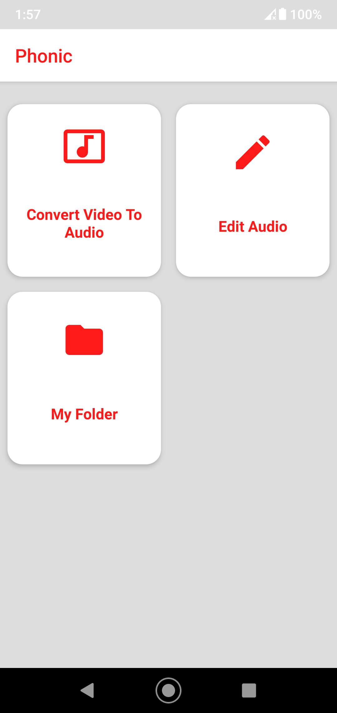
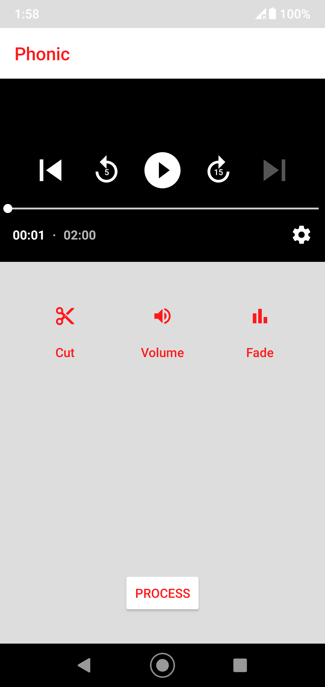
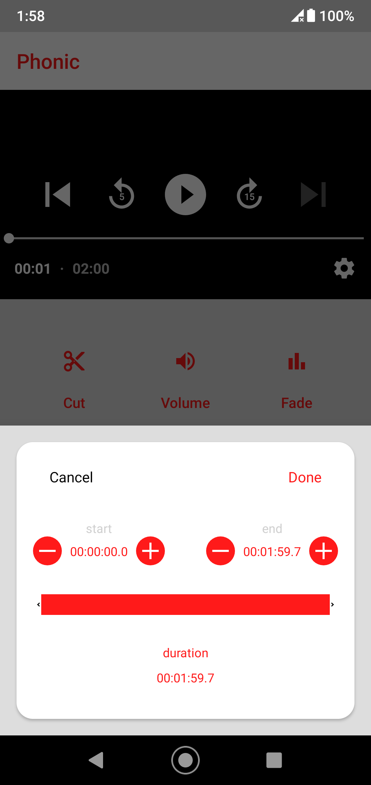
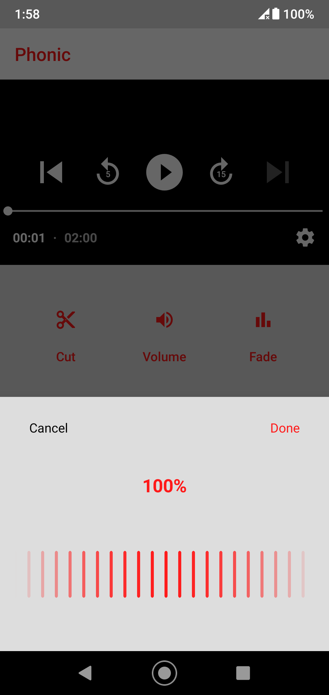
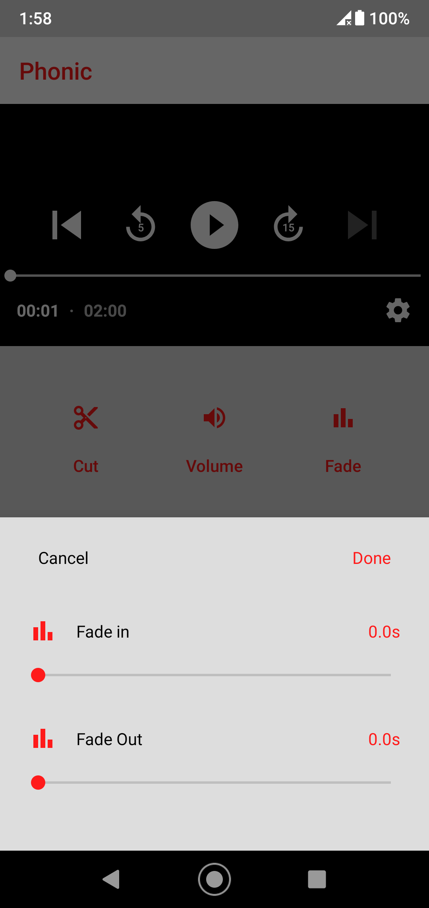
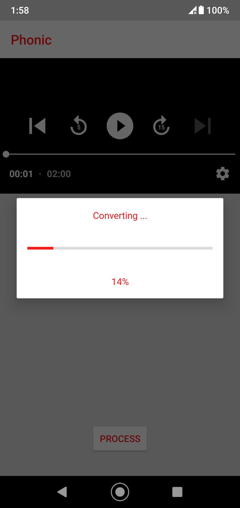
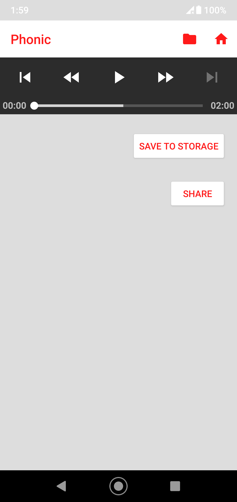

# Video To Audio Converter

**An Android application to extract and convert audio from your video and audio files with ease.**

---

## Overview

Video To Audio Converter is a simple yet powerful Android application that allows users to convert video files into high-quality audio formats quickly. This app is designed to showcase my skills in Android development, multimedia processing, and user interface design. It is perfect for creating podcasts, extracting soundtracks, or simply saving your favorite audio from videos.

---

## Features

- **Easy Conversion:** Convert videos to popular audio formats with just a few taps.
- **Multi-format Support:** Works with various video file formats.
- **Optimized Performance:** Efficient processing that preserves audio quality.
- **User-Friendly Interface:** Clean and intuitive design for a seamless user experience.
- **Lightweight:** Minimal resource usage without sacrificing performance.

---

## Technologies Used

- **Android SDK:** Core platform for building and running the application.
- **Java/Kotlin:** Primary programming language for development.
- **FFmpeg (Optional):** Used for reliable audio extraction and conversion.
- **Gradle:** Build automation and dependency management.

---

## Installation

Follow these steps to get the app up and running:

1. **Clone the Repository:**

   ```bash
   git clone https://github.com/stsaikat/videotoaudioconverter.git
   ```

2. **Open in Android Studio:**
   - Launch Android Studio.
   - Navigate to **File > Open** and select the cloned repository folder.

3. **Build and Run:**
   - Sync Gradle to download all necessary dependencies.
   - Build the project and run it on your Android emulator or physical device.

---

## Usage

1. **Launch the App:** Open the Video To Audio Converter on your Android device.
2. **Select a Video:** Choose a video file from your device storage.
3. **Choose an Audio Format:** Select the desired output format (e.g., MP3, AAC).
4. **Convert:** Tap the convert button and wait for the process to complete.
5. **Save/Share:** Save the generated audio file or share it directly from the app.

---

## Screenshots

<p float="left">
  
  
  
  
  
  
  
</p>

---

## Contributing

Contributions are welcome! If you'd like to improve the project:

1. Fork the repository.
2. Create a new branch for your feature or bug fix.
3. Submit a pull request with detailed descriptions of your changes.

---

## License

This project is licensed under the [MIT License](LICENSE).

---

## Contact

Developed by **Sunipun Talukder**.  
GitHub: [stsaikat](https://github.com/stsaikat)  
Email: [talukdersunipun@gmail.com](mailto:talukdersunipun@gmail.com)